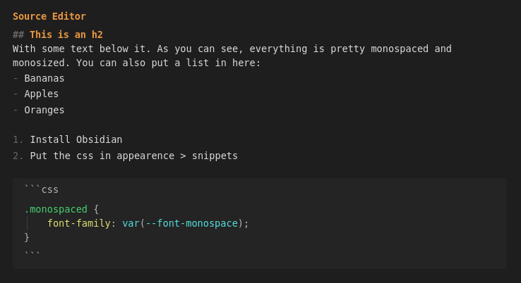

A small Obsidian css snippet, that makes the source editor use a monospaced font and a monosized design, similar to Vscode.



To use this snippet, go to ```Settings > Appearence > CSS Snippets``` and click on the folder icon. Download the css file and put it there.

The snippet only works with live preview disabled. You can turn it off per file using the three dots or globally in ```Settings > Editor > Default Editing Mode = Source Mode```
